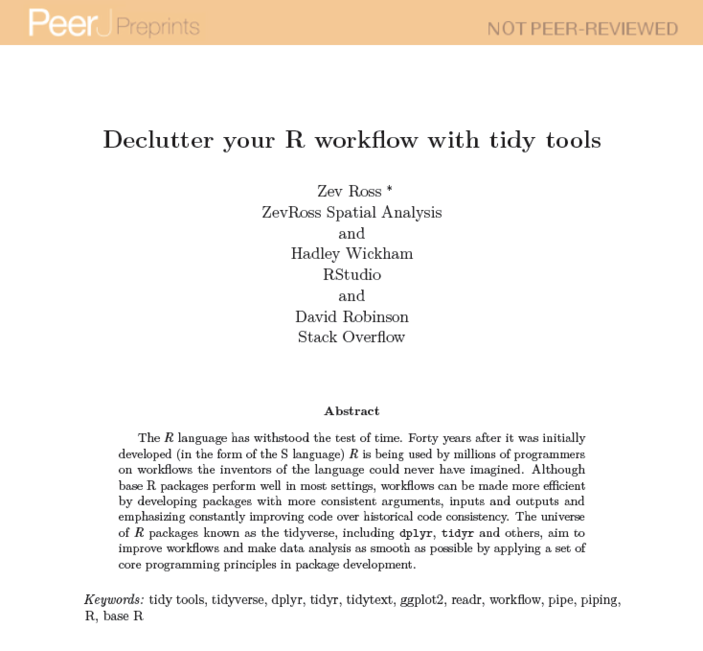

# **Tidyverse**

- _Tidy_ pour "bien rangé" et _verse_ pour "univers" 

- A collection of R `r emo::ji("package")` developed by H. Wickham and others at Rstudio

```{r echo=FALSE, out.width = "50%", fig.align="center"}
knitr::include_graphics("wickham_president.jpg")
```


---

# **Tidyverse**

* "Un modèle d’organisation des données qui vise à faciliter le travail souvent long et fastidieux de nettoyage et de préparation préalable à la mise en oeuvre de méthodes d’analyse" (Julien Barnier).

* Les principes d’un tidy data sont :
    - chaque variable est une colonne
    - chaque observation est une ligne
    - chaque type d’observation est dans une table différente
    
```{r echo=FALSE, out.width = "80%", fig.align="center"}
knitr::include_graphics("tidydata.png")
```


---

# **Tidyverse** is a collection of R `r emo::ji("package")`


* `ggplot2` - visualisation

* `dplyr` - manipulation et synthèse des données

* `tidyr` - manipulation des données

* `purrr` - programmation avancée

* `readr` - importation de données

* `tibble` - tableaux de données data.frame améliorés

* `forcats` - variables qualitatives

* `stringr` - chaînes de caractères

---

# **Tidyverse** is a collection of R `r emo::ji("package")`

* [`ggplot2` - visualisation](https://ggplot2.tidyverse.org/)

* [`dplyr` - manipulation et synthèse des données](https://dplyr.tidyverse.org/)

* `tidyr` - manipulation des données

* `purrr` - programmation avancée

* [`readr` - importation de données](https://readr.tidyverse.org/)

* [`tibble` - tableaux de données data.frame améliorés](https://tibble.tidyverse.org/)

* `forcats` - variables qualitatives

* `stringr` - chaînes de caractères


---
class: middle


# Workflow in data science

```{r, echo=FALSE, out.width = '100%', fig.align="center"}
knitr::include_graphics("data-science-workflow.png")
```

---
class: middle

# Workflow in data science, with **Tidyverse**

```{r, echo=FALSE, out.width = '90%', fig.align="center"}
knitr::include_graphics("01_tidyverse_data_science.png")
```

---
background-image: url(https://github.com/rstudio/hex-stickers/raw/master/SVG/tidyverse.svg?sanitize=true)
background-size: 100px
background-position: 90% 3%

# Load [tidyverse](www.tidyverse.org) `r emo::ji("package")`

```{r}
#install.packages("tidyverse")
library(tidyverse)
```

---
class: inverse, center, middle

# Import, Tidy, Transform

---
class: middle

# [Case study](https://peerj.com/preprints/3180/) with Shakespeare's word usage

```{r, echo=FALSE, out.width = '75%', fig.align="center"}

```


---

# Import data

**readr::read_csv** function:

* keeps input types as is (no conversion to factor)

* creates `tibbles` instead of `data.frame`
     - pas de noms de lignes (rownames)
     - autorisent noms de colonnes avec caractères spéciaux ou nombres
     - s'affichent plus intelligemment que les data.frames
     - pas de partial matching sur noms de colonnes
     - avertissement si on essaie d’accéder à une colonne inexistante
     
* is damn fast `r emo::ji("racing_car")`

---

# Import data

**readr::read_csv** function:

```{r message=FALSE, warning=FALSE, paged.print=FALSE, cache=TRUE}
shakespeare <- read_csv('https://gist.githubusercontent.com/zross/ab72ba3250a3ee58e4e7/raw/07f1aa98dd4041f3bb0971d1b213a22302d26488/shakespeare.csv') #<<
shakespeare
```


---

# Group by variable to perform operation

**dplyr::group_by** function:
```{r message=FALSE, warning=FALSE, paged.print=FALSE}
shakespeare_corpus <- group_by(shakespeare, corpus) #<<
shakespeare_corpus
```

---

# Summarise data by group 

**dplyr::summarise** function:
```{r message=FALSE, warning=FALSE, paged.print=FALSE}
mean_shakespeare_corpus <- summarise(shakespeare_corpus,avg=mean(word_count)) #<<
mean_shakespeare_corpus
```

---

# Cleaner code with "pipe" operator `%>%`

```{r message=FALSE, warning=FALSE, paged.print=FALSE}
shakespeare %>% 
  group_by(corpus) %>% # group by corpus 
  summarise(avg = mean(word_count)) # compute mean
```

---

# Compare to base R

```{r message=FALSE, warning=FALSE, paged.print=FALSE}
with(shakespeare, tapply(word_count, corpus, mean))
```


---

# Deselect columns

**dplyr::select** function:
```{r message=FALSE, warning=FALSE, paged.print=FALSE}
shakespeare %>% 
  select(-X1, -corpus_date) # deselect columns #<<
```

---

# Select columns

**dplyr::select** function:
```{r message=FALSE, warning=FALSE, paged.print=FALSE}
shakespeare %>% 
  select(word, word_count, corpus) # select columns #<<
```

---

# Syntax with pipe

* Verb(Subject,Complement) replaced by Subject %>% Verb(Complement)


* No need to name unimportant intermediate variables


* Clear syntax (readability)

```{r echo=FALSE, out.width = "40%", fig.align="center"}
knitr::include_graphics("logo_pipe.png")
```

---

# Create new column

**dplyr::mutate** function:
```{r message=FALSE, warning=FALSE, paged.print=FALSE}
shakespeare %>%
  mutate(word = str_to_lower(word)) # convert words to lowercase #<<
```

---

# Count number of words in each corpus

```{r message=FALSE, warning=FALSE, paged.print=FALSE}
shakespeare %>%
  mutate(word = str_to_lower(word)) %>% # convert words to lowercase
  group_by(word, corpus) %>% # group by word within corpus
  summarize(n = sum(word_count)) # count #<<
```

---

# Order stuff

**dplyr::arrange** function:
```{r message=FALSE, warning=FALSE, paged.print=FALSE}
shakespeare %>%
  mutate(word = str_to_lower(word)) %>% # convert words to lowercase
  group_by(word, corpus) %>% # group by word within corpus
  summarize(n = sum(word_count)) %>% # count 
  arrange(desc(n)) # decreasing order (wo desc for increasing) #<<
```

---

# Nb of times a word occurs across all corpus

```{r message=FALSE, warning=FALSE, paged.print=FALSE}
shakespeare %>%
  mutate(word = str_to_lower(word)) %>% # convert words to lowercase
  group_by(word) %>% # group by word
  summarize(n = sum(word_count), 
            corpus = n_distinct(corpus)) %>% # count #<<
  arrange(desc(n)) # decreasing order
```

---

# Name this processed dataset

```{r message=FALSE, warning=FALSE, paged.print=FALSE}
shakespeare_processed <- shakespeare %>% #<<
  mutate(word = str_to_lower(word)) %>% # convert words to lowercase
  group_by(word) %>% # group by word
  summarize(n = sum(word_count), 
            corpus = n_distinct(corpus)) %>% # count
  arrange(desc(n)) # decreasing order
shakespeare_processed #<<
```

---

# Get rid of common words

**dplyr::anti_join** function:
```{r message=FALSE, warning=FALSE, paged.print=FALSE}
words <- shakespeare_processed %>%
  group_by(word) %>% # group by word within corpus
  anti_join(tidytext::stop_words) %>% # returns all rows from #<<
                                      # shakespeare that do not #<<
                                      # match the stop words #<<
  arrange(desc(n))
words
```

---

# Find words > 4 char not in all corpus

**dplyr::filter** function to select rows:
```{r message=FALSE, warning=FALSE, paged.print=FALSE}
words <- words %>% 
  filter(corpus < 42, nchar(word) > 4) %>% #<<
  arrange(desc(n))
words
```

---
background-image: url(https://github.com/rstudio/hex-stickers/raw/master/SVG/tidyverse.svg?sanitize=true)
background-size: 100px
background-position: 90% 3%

# Check out other functions

* **spread()** and **gather()** from package `tidyr` to reshape tibbles


* **inner_join()**, **left_join()**, **right_join()**, **full_join()**, **semi_join()** and **anti_join()** from package `dplyr` to join two tibbles together


* **year()**, **month()**, etc... from package `lubridate` to manipulate dates

* Feel free to explore other Tidyverse packages, in particular `forcats` and `stringr` 

```{r echo=FALSE, out.width = "100%", fig.align="center"}
knitr::include_graphics("tidyband.png")
```

---
class: inverse, center, middle

# Visualize


---
class: center

# Case study on Fisher's iris dataset

```{r, echo=FALSE, out.width = '65%', fig.align="center"}
knitr::include_graphics("iris.png")
```


---

# Visualization with ggplot2

* The package ggplot2 implements a **g**rammar of **g**raphics

* Operates on data.frames or tibbles, not vectors like base R

* Explicitly differentiates between the data and its representation

```{r echo=FALSE, out.width = "30%", fig.align="center"}
knitr::include_graphics("ggplot2_logo.jpg")
```

---

# The ggplot2 grammar


 Grammar element   | What it is                                       
 :---------------- | :-----------------------------                   
 **Data**          | The data frame being plotted                     
 **Geometrics**    | The geometric shape that will represent the data 
                   | (e.g., point, boxplot, histogram)                
 **Aesthetics**    | The aesthetics of the geometric object           
                   | (e.g., color, size, shape)                       


```{r echo=FALSE, out.width = "30%", fig.align="center"}
knitr::include_graphics("ggplot2_logo.jpg")
```


---

# Scatterplots

```{r message=FALSE, warning=FALSE, paged.print=FALSE, fig.height = 5, fig.width = 5, fig.align = "center"}
iris %>% 
  ggplot() + 
  geom_point(aes(x = Sepal.Length, y = Petal.Length))
```

---

# Scatterplots

```{r message=FALSE, warning=FALSE, paged.print=FALSE, fig.height = 4, fig.width = 4, fig.align = "center", eval=FALSE}
iris %>%  #<<
  ggplot() + 
  geom_point(aes(x = Sepal.Length, y = Petal.Length))
```
* Pass in the data frame as your first argument

---

# Scatterplots

```{r message=FALSE, warning=FALSE, paged.print=FALSE, fig.height = 4, fig.width = 4, fig.align = "center", eval=FALSE}
iris %>%  
  ggplot() + 
  geom_point(aes(x = Sepal.Length, y = Petal.Length)) #<<
```
* Pass in the data frame as your first argument
* Aesthetics maps the data onto plot characteristics, here x and y axes

---

# Scatterplots

```{r message=FALSE, warning=FALSE, paged.print=FALSE, fig.height = 4, fig.width = 4, fig.align = "center", eval=FALSE}
iris %>%  
  ggplot() + 
  geom_point(aes(x = Sepal.Length, y = Petal.Length)) #<<
```
* Pass in the data frame as your first argument
* Aesthetics maps the data onto plot characteristics, here x and y axes
* Display the data geometrically as points

---

# Scatterplots, with colors

```{r message=FALSE, warning=FALSE, paged.print=FALSE, fig.height = 5, fig.width = 5, fig.align = "center"}
iris %>% 
  ggplot() + 
  geom_point(aes(x = Sepal.Length, y = Petal.Length), color = "red") #<<
```

---

# Scatterplots, with species-specific colors

```{r message=FALSE, warning=FALSE, paged.print=FALSE, fig.height = 5, fig.width = 5, fig.align = "center"}
iris %>% 
  ggplot() + 
  geom_point(aes(x = Sepal.Length, y = Petal.Length, color = Species)) #<<
```

* Placing color inside aesthetic maps it to the data

---

# Scatterplots, with species-specific shapes

```{r message=FALSE, warning=FALSE, paged.print=FALSE, fig.height = 5, fig.width = 5, fig.align = "center"}
iris %>% 
  ggplot() + 
  geom_point(aes(x = Sepal.Length, y = Petal.Length, shape = Species)) #<<
```

---

# Scatterplots, lines instead of points

```{r message=FALSE, warning=FALSE, paged.print=FALSE, fig.height = 5, fig.width = 5, fig.align = "center"}
iris %>% 
  ggplot() + 
  geom_line(aes(x = Sepal.Length, y = Petal.Length, color = Species)) #<<
```

---

# Scatterplots, add points

```{r message=FALSE, warning=FALSE, paged.print=FALSE, fig.height = 5, fig.width = 5, fig.align = "center"}
iris %>% 
  ggplot() + 
  geom_line(aes(x = Sepal.Length, y = Petal.Length, color = Species)) + 
  geom_point(aes(x = Sepal.Length, y = Petal.Length)) #<<
```

---


# aes ou pas aes?

* Si on établit un lien entre les valeurs d'une variable et un attribut graphique, on définit un mappage, et on le déclare dans aes(). 

* Sinon, on modifie l'attribut de la même manière pour tous les points, et on le définit en dehors de la fonction aes(). 

```{r echo=FALSE, out.width = "30%", fig.align="center"}
knitr::include_graphics("ggplot2_logo.jpg")
```

---

# Histograms

```{r message=FALSE, warning=FALSE, paged.print=FALSE, fig.height = 5, fig.width = 5, fig.align = "center"}
iris %>% 
  ggplot() + 
  geom_histogram(aes(x = Sepal.Length)) #<<
```

---

# Histograms, with colors

```{r message=FALSE, warning=FALSE, paged.print=FALSE, fig.height = 5, fig.width = 5, fig.align = "center"}
iris %>% 
  ggplot() + 
  geom_histogram(aes(x = Sepal.Length), fill = "orange") #<<
```

---

# Histograms, with colors

```{r message=FALSE, warning=FALSE, paged.print=FALSE, fig.height = 5, fig.width = 5, fig.align = "center"}
iris %>% 
  ggplot() + 
  geom_histogram(aes(x = Sepal.Length), fill = "orange", color = "brown") #<<
```

---

# Histograms, with labels and title

```{r message=FALSE, warning=FALSE, paged.print=FALSE, fig.height = 5, fig.width = 5, fig.align = "center"}
iris %>% 
  ggplot() + 
  geom_histogram(aes(x = Sepal.Length), fill = "orange", color = "brown") + 
  xlab("Sepal Length") + #<<
  ylab("Count") + #<<
  ggtitle("Histogram of iris sepal lengths") #<<
```

---

# Histograms, by species

```{r message=FALSE, warning=FALSE, paged.print=FALSE, fig.height = 4, fig.width = 7, fig.align = "center"}
iris %>% 
  ggplot() + 
  geom_histogram(aes(x = Sepal.Length), fill = "orange", color = "brown") + 
  xlab("Sepal Length") + 
  ylab("Count") + 
  ggtitle("Histogram of iris sepal lengths") + 
  facet_wrap(aes(Species)) #<<
```

---

# Boxplots

```{r message=FALSE, warning=FALSE, paged.print=FALSE, fig.height = 5, fig.width = 5, fig.align = "center"}
iris %>% 
  ggplot() + 
  geom_boxplot(aes(x = "", y = Sepal.Length)) #<<
```

---

# Boxplots with colors

```{r message=FALSE, warning=FALSE, paged.print=FALSE, fig.height = 5, fig.width = 5, fig.align = "center"}
iris %>% 
  ggplot() + 
  geom_boxplot(aes(x = "", y = Sepal.Length), fill = "green") #<<
```

---

# Boxplots with colors by species

```{r message=FALSE, warning=FALSE, paged.print=FALSE, fig.height = 5, fig.width = 5, fig.align = "center"}
iris %>% 
  ggplot() + 
  geom_boxplot(aes(x = Species, y = Sepal.Length, fill = Species)) #<<
```

---

# Boxplots, user-specified colors by species 

```{r message=FALSE, warning=FALSE, paged.print=FALSE, fig.height = 5, fig.width = 5, fig.align = "center"}
iris %>% 
  ggplot() + 
  geom_boxplot(aes(x = Species, y = Sepal.Length, fill = Species)) +
  scale_fill_manual(values=c("red", "blue", "purple")) #<<
```

---

# Boxplots, change legend settings

```{r message=FALSE, warning=FALSE, paged.print=FALSE, fig.height = 5, fig.width = 5, fig.align = "center"}
iris %>% 
  ggplot() + 
  geom_boxplot(aes(x = Species, y = Sepal.Length, fill = Species)) +
  scale_fill_manual(
    values=c("red", "blue", "purple"), 
    name = "Species name", #<<
    labels=c("SETOSA", "VIRGINICA", "VERSICOLOR")) #<<
```

---

# Density plots

```{r message=FALSE, warning=FALSE, paged.print=FALSE, fig.height = 5, fig.width = 5, fig.align = "center"}
iris %>%
  ggplot() + 
  geom_density(aes(x = Sepal.Length, fill = Species)) #<<
```

---

# Density plots, control transparency

```{r message=FALSE, warning=FALSE, paged.print=FALSE, fig.height = 5, fig.width = 5, fig.align = "center"}
iris %>%
  ggplot() + 
  geom_density(aes(x = Sepal.Length, fill = Species), alpha = 0.5) #<<
```

---

# Change default background theme 1/3

```{r message=FALSE, warning=FALSE, paged.print=FALSE, fig.height = 5, fig.width = 5, fig.align = "center"}
iris %>%
  ggplot() + 
  geom_density(aes(x = Sepal.Length, fill = Species), alpha = 0.5) +
  theme_bw() #<<
```

---

# Change default background theme 2/3

```{r message=FALSE, warning=FALSE, paged.print=FALSE, fig.height = 5, fig.width = 5, fig.align = "center"}
iris %>%
  ggplot() + 
  geom_density(aes(x = Sepal.Length, fill = Species), alpha = 0.5) +
  theme_classic() #<<
```

---

# Change default background theme 3/3

```{r message=FALSE, warning=FALSE, paged.print=FALSE, fig.height = 5, fig.width = 5, fig.align = "center"}
iris %>%
  ggplot() + 
  geom_density(aes(x = Sepal.Length, fill = Species), alpha = 0.5) +
  theme_dark() #<<
```

---

background-image: url(https://github.com/rstudio/hex-stickers/raw/master/SVG/tidyverse.svg?sanitize=true)
background-size: 550px
background-position: 50% 50%


---

# To dive even deeper in the tidyverse

* [Learn the tidyverse](https://www.tidyverse.org/learn/): books, workshops and online courses


* My selection of books:
   - [R for Data Science](https://r4ds.had.co.nz/) et [Advanced R](http://adv-r.had.co.nz/)
   - [Introduction à R et au tidyverse](https://juba.github.io/tidyverse/)
   - [Fundamentals of Data visualization](https://serialmentor.com/dataviz/)
   - [Data Visualization: A practical introduction](http://socviz.co/)
   
   
* [Tidy Tuesdays videos](https://www.youtube.com/user/safe4democracy/videos) by D. Robinson chief data scientist at DataCamp

---

# [Blog Lise Vaudor](http://perso.ens-lyon.fr/lise.vaudor/)

## Base R

```{r, eval = FALSE}
white_and_yolk <- crack(egg, add_seasoning)
omelette_batter <- beat(white_and_yolk)
omelette_with_chives <- cook(omelette_batter,add_chives)
```

```{r echo=FALSE, message=FALSE, warning=FALSE, paged.print=FALSE, out.width = "400px", fig.align = "center"}
knitr::include_graphics("piping_successive.jpg")
```

---

# [Blog Lise Vaudor](http://perso.ens-lyon.fr/lise.vaudor/)

## Piping

```{r, eval = FALSE}
egg %>% 
  crack(add_seasoning) %>% 
  beat() %>% 
  cook(add_chives) -> omelette_with_chives
```

```{r echo=FALSE, message=FALSE, warning=FALSE, paged.print=FALSE, out.width = "200px", fig.align = "center"}
knitr::include_graphics("piping_piped.png")
```

---

# The [RStudio Cheat Sheets](https://www.rstudio.com/resources/cheatsheets/)

```{r echo=FALSE, message=FALSE, warning=FALSE, paged.print=FALSE, out.width = "600px", fig.align = "center"}
knitr::include_graphics("cheatsheet_dplyr.png")
```


---
class: title-slide-final, middle
background-size: 55px
background-position: 9% 15%

# Thanks!

### I created these slides with [xaringan](https://github.com/yihui/xaringan) and [RMarkdown](https://rmarkdown.rstudio.com/) using the [rutgers css](https://github.com/jvcasillas/ru_xaringan) that I slightly modified.

### Credit: I used material from [Cécile Sauder](https://github.com/cecilesauder/RLadiesTidyverse), [Stephanie J. Spielman](http://sjspielman.org/bio5312_fall2017/) and [Julien Barnier](https://juba.github.io/tidyverse/).


|                                                                                                            |                                   |
| :--------------------------------------------------------------------------------------------------------- | :-------------------------------- |
| `r icon::fa("envelope")` | **olivier.gimenez@cefe.cnrs.fr**       |
| `r icon::fa("home")` | [**https://oliviergimenez.github.io/**](https://oliviergimenez.github.io/) |
| `r icon::fa_twitter()` | [**@oaggimenez**](https://twitter.com/oaggimenez)                         |
| `r icon::fa_github()` | [**@oliviergimenez**](https://github.com/oliviergimenez)

